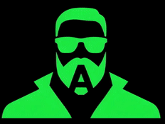
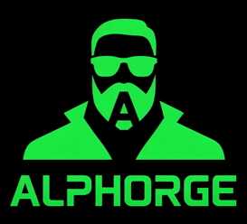

# ALPHorge

**Pronounced:** “ALF-forj”

**One-liner:** Turn first signals into relationships, meetings, and signed deals. From signal to signed.

<table>
<tr>
<td align="center">
   
  Animated Text
</td>
<td align="center">
   
  Animated Icon
</td>
<td align="center">
   
  Icon + Text Animation
</td>
</tr>
</table>

## What ALPHorge means

- **Alpha** = first, best, signal, first contact, first reply.  
- **Forge** = craft, shape, harden, ship to production.  
- **Together** = a place where first‑rate signals are forged into interviews, offers, and hires.

## Who it’s for

- **Candidates:** Finds the right people, helps you start genuine conversations, and turns them into interviews and offers.  
- **Recruiters/Agencies:** Forges shortlists fast, writes hiring‑manager briefs, and sequences proof‑based outreach to signed offers.  
- **Coaches:** Package DFY outreach into a relationship engine that books calls and closes engagements.

## Product modules

- **Foundry** – IJP → scrape → match → contacts → outreach (the core wizard).  
- **Anvil** – deliverability & compliance checks (SPF/DKIM/DMARC, send caps, opt‑outs).  
- **Hammer** – sequencing, A/B tests, Instantly export/API.  
- **Quench** – analytics: opens, replies, positive replies, meetings booked, offers.  
- **Scout** – prospecting add‑on for people and roles (warm‑angle discovery).

## Relationship‑first features

- Warm‑angle finder (mutuals, alma mater, podcast mentions, recent posts).  
- Intro builder (tight value intro + two soft asks); “relationship note” per contact.  
- Light CRM: People → Conversation → Meeting → Deal, with next steps and sentiment.  
- Intro loops via mutuals with accept/decline tracking.  
- Referral tracking and thank‑you prompts.  
- Meeting kit: auto‑insert your exact Calendly line, one‑pager, 30‑sec video, and three time windows.  
- Deal assistant: turn a positive reply into a recap + next‑step task.  
- Objection handler: classifies pushbacks and proposes short replies with proof.  
- Relationship health: score from last touch, reply quality, and value shared.  
- Receipts: meeting booked, pilot accepted, offer extended.

## Quick sequences

**Short opener**  
“Hi {FirstName}, I enjoyed {TheirRecentThing}. I work on {YourEdge} and thought {SpecificBenefit} might help at {Company}. Open to a quick intro chat? Please find some availability in my calendar: {CalendlyURL}.”

**Value follow‑up**  
“Sharing a 1‑pager that maps {TheirGoal} to {YourApproach}. If useful, happy to walk through it. Calendly: {CalendlyURL}.”

**Close‑the‑loop nudge**  
“If now isn’t the right time, I can check back in a month with a relevant case study. Does that help?”

## MVP scope (mapped to workflow)

- Import Indeed via Apify and normalize to `JobPosting`.  
- Parse resume into **Key Metrics**, **Problems Solved**, **Notable Accomplishments**, **Positions**, **Tenure**.  
- Score match with reasons and blockers; highlight evidence sentences.  
- Enrich contacts (Apollo/Apify People), dedupe, verify.  
- Draft short/medium/long emails + two follow‑ups for recruiter & candidate modes.  
- Export Instantly‑ready CSV; basic analytics dashboard.  
- Light CRM stages and a Meeting Kit (uses your **exact** Calendly line).

## Brand & identity

- **Mark:** Greek alpha shaped into an anvil, with a small spark.  
- **Palette:** deep charcoal, steel, electric accent for the spark.  
- **Voice:** plain‑spoken, confident, action verbs.

## License

Copyright © 2025 Reliable AI Network, LLC. All rights reserved.
